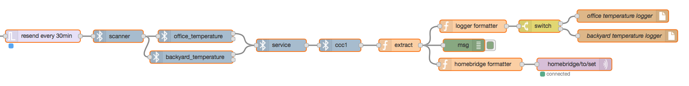
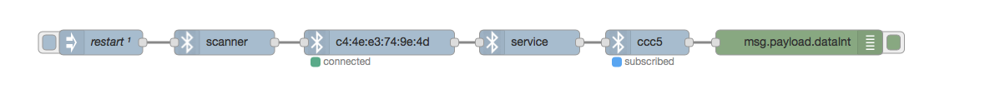

# ignoble

A Node-Red BLE (Bluetooth Low Energy) central module.

## Prerequisites

Will work anywhere that [noble](https://github.com/sandeepmistry/noble) works.

Tested with Raspberry Pi Zero W (CYW43438), Nano Pi NEO AIR (AP6212A), and Red Bear BLE Nano V2 (nRF52x).

## Installation

```
sudo npm install node-red-contrib-ignoble
```

## Usage

Create a scanner node.  This does not run by itself - hook up a trigger to it!

Connect a peripheral node to the scanner node and configure it to your liking, or don't.

Connect a service node to the peripheral node.  This node just transforms data.  You need it.

Connect a characteristic node to the service node.  This node will let you fish out characteristic data.

After the characteric node has run, msg.payload will contain its data - this can be shunted to other nodes like MQTT, Twitter or a debug node.

## Example
An example flow of two temperature sensors being polled every 30 minutes and characteristics exposed over Homebridge/MQTT.  A third SHT21 sensor will push its temperature (2a6e) when the characteristic changes.



An example flow of subscribing to a peripheral's ccc5 characteristic.  Set the peripheral's timeout to 0 and turn on the characteristic's subscribe flag to maintain notifications forever or until the device is disconnected.


